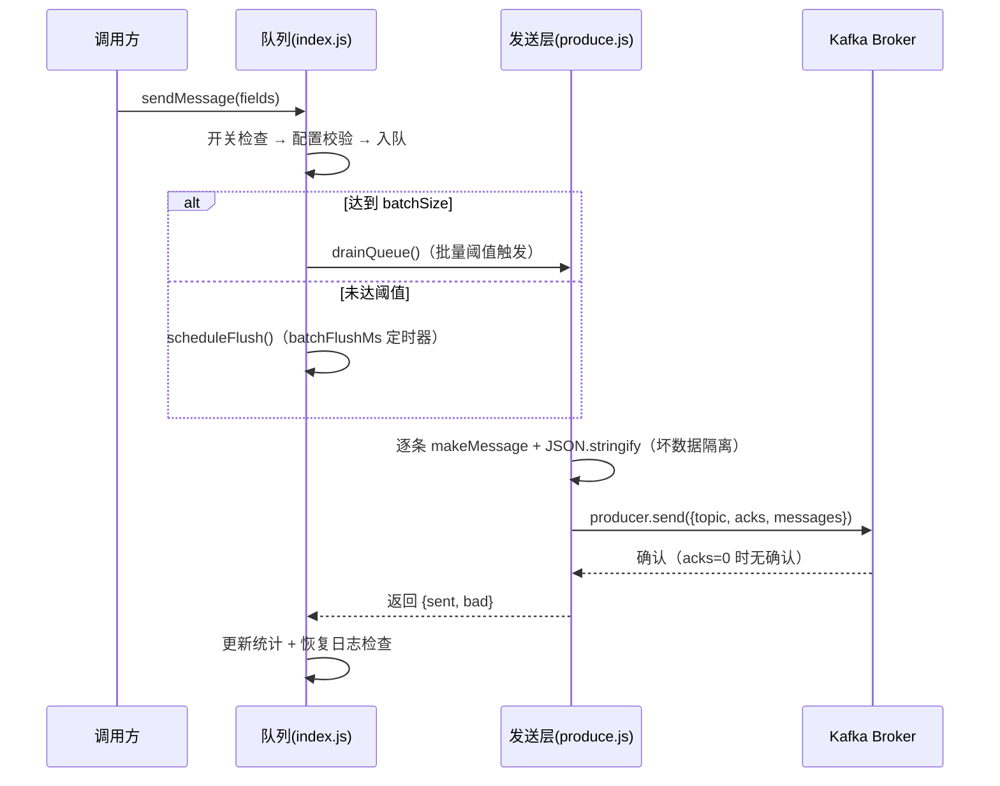

# 外挂式 Kafka 日志客户端系统设计

> 组件：`src/utils/kfk/`（`config.js` / `kafka.js` / `produce.js` / `index.js`）
> 运行环境：Node.js ≥ 22（纯 ESM），依赖 KafkaJS ^2.2.4
> 本文档视角：系统设计评审（需求 → 架构 → 流程 → 决策 → 接口 → 运维）

## 1. 背景与目标

### 1.1 业务背景

coqi-claw 是一个 AI Agent 系统（CLI / REPL / Web 三种形态）。运营侧需要消费关键业务事件（会话开始、技能调用、安全告警、审计命中）用于行为分析。这些事件通过 Kafka 主题 `eagent.runtime.log.v1` 异步送达。

### 1.2 非功能需求（NFR）

| 编号 | 需求 | 验收标准 |
|------|------|----------|
| NFR-1 | 调用方零阻塞 | `sendMessage()` 为同步函数，任何情况下不抛出、不等待网络 |
| NFR-2 | 故障有界 | broker 完全不可达时，`flush()`/`close()` 在 `KAFKA_FLUSH_TIMEOUT_MS` 内返回 |
| NFR-3 | 进程安全 | 故障期间无 unhandled rejection、无未捕获异常导致进程退出 |
| NFR-4 | 内存有界 | 队列内存占用有硬上限，不随消息速率增长 |
| NFR-5 | 允许丢消息 | 日志类数据可丢失；丢弃必须可计数、可观测 |
| NFR-6 | 日志可控 | 故障期间日志输出量有界（窗口化节流），不刷屏 |
| NFR-7 | 可观测 | 关键路径（发送/失败/丢弃/跳过/恢复）均可通过统计与日志还原 |
| NFR-8 | 自愈 | broker 恢复后自动重建连接，无需重启或人工干预 |

### 1.2.1 性能指标

| 编号 | 指标 | 目标 | 依据 |
|------|------|------|------|
| PERF-1 | 单实例吞吐 | ≥ 1000 msg/s | 业务事件峰值（会话/技能/审计）< 100 msg/s，留 10 倍余量 |
| PERF-2 | 调用方同步路径延迟 | < 1ms | `sendMessage()` 仅做内存入队，无网络、无锁 |
| PERF-3 | 端到端送达延迟上界 | ≤ `KAFKA_BATCH_FLUSH_MS`（默认 15s） | 时间窗触发兜底，该值即「延迟-吞吐」旋钮 |
| PERF-4 | 空闲资源 | 零网络连接 | 懒初始化：无消息不建连 |
| PERF-5 | 故障期资源 | 无连接风暴、日志输出有界 | 5s 退避窗口 + 60s 日志节流窗口 |

### 1.3 设计约束

- **外挂定位**：Kafka 不在本组件的故障域内，组件不得反向影响宿主；
- **配置时序**：`.env` 由 BootstrapManager 分阶段加载（加载 → 解密 → overlay → CLI 覆盖），组件不得在启动早期缓存配置；
- **无框架**：项目无 DI 容器、无测试框架，组件需自包含、可直接 `node --check` 验证语法。

## 2. 总体架构

### 2.1 分层视图

```
┌────────────────────────────────────────────────────────┐
│ 宿主（Host）                                            │
│  audit-reviewer / session-repository / skill-view / TUI │
└────────────────────────┬───────────────────────────────┘
                         │ 同步调用（不 await）
┌────────────────────────▼───────────────────────────────┐
│ 门面层  index.js                                       │
│  开关 → 配置校验 → 入队 → 攒批触发                       │
│  flush/close（超时）/ getStats / setEnabled             │
│  失败日志节流（窗口去重 + 汇总 + 恢复）                  │
├────────────────────────────────────────────────────────┤
│ 发送层  produce.js                                     │
│  makeMessage（payload 组装）→ getProducer（单例+退避）   │
│  produceOne / produceBatch（坏数据隔离）                 │
│  markProducerFailed（send 失败重置）/ closeProducer      │
├────────────────────────────────────────────────────────┤
│ 连接层  kafka.js / config.js                           │
│  KafkaJS 实例（TLS + SASL）+ SSL 配置                   │
│  getConfig() 惰性读取 process.env                       │
└────────────────────────────────────────────────────────┘
```

### 2.2 模块职责

| 模块 | 职责 | 禁止职责 |
|------|------|----------|
| `index.js` | 队列、节流、统计、对外 API | 不得直接触碰 KafkaJS |
| `produce.js` | payload 组装、连接生命周期、发送 | 不得做队列/节流决策 |
| `kafka.js` | KafkaJS 实例与 SSL 配置 | 不得有业务逻辑 |
| `config.js` | 环境变量读取（惰性） | 不得缓存值 |

### 2.3 集成点

| 集成方 | 使用方式 | 时机 |
|--------|----------|------|
| `audit-reviewer.js` / `session-repository.js` / `skill-view.js` | `sendMessage({...})` | 业务事件发生即发送 |
| `bootstrap/manager.js`、`tui/utils.js` | `close()` | 进程退出前 |
| 运营控制台（潜在） | `setEnabled()` / `getStats()` | 运行时熔断/观测 |

## 3. 核心流程设计

### 3.1 消息生命周期（正常路径）



### 3.2 攒批触发策略（双触发）

```
触发条件（任一满足）：
  A. 队列长度 ≥ batchSize（默认 50）  → 立即 drain（低延迟路径）
  B. 首次入队后经过 batchFlushMs（默认 15s）→ 定时器 drain（吞吐兜底路径）

并发保护：
  drainPromise 单例——并发调用共享同一 drain，不会重复发送；
  drain 进行中不重复调度 flushTimer。
```

### 3.3 连接故障状态机

```
                    ┌────────────────────────────┐
                    │                            │
                    ▼                            │
┌────────────┐  connect/send 失败   ┌──────────────────────┐
│  已连接     │─────────────────────▶│  退避中（5s 窗口）    │
│  producer  │                     │  producerPromise=null │
└────────────┘                     │  lastConnectErrorAt=now│
      ▲                            └───────────┬──────────┘
      │                                          │ 窗口过期后
      │  connect 成功（自愈）                     │ 有新消息触发
      └──────────────────────────────────────────┘
        下次 drain → getProducer() 重新建连
```

两条失败路径统一收敛到该状态机：

| 失败点 | 处理 |
|--------|------|
| `connect()` 失败 | 重置单例 + 记录退避时间戳（`getProducer` 内部） |
| `send()` 失败（连接建立后 broker 挂掉） | `markProducerFailed()`：异步 disconnect 旧实例（防 socket 泄漏）+ 重置 + 退避 |

退避窗口内的发送请求快速失败（错误带 `KAFKA_BACKOFF` 标记），消息计 `failed`。

### 3.4 关闭路径（有界性保证）

```
close()
 ├─ flush()         ── 清空队列；超时（flushTimeoutMs）→ 放弃剩余（计 dropped）
 └─ closeProducer() ── disconnect；超时兜底 → 直接返回（后台收尾）
```

两层超时保证：任何时刻调用 `close()`，最坏在 `2 × flushTimeoutMs` 内返回。

## 4. 性能设计：吞吐与开销控制

日志发送是高频低价值的操作，性能设计的目标不是「最快」，而是**让每条消息的边际成本趋近于零**：攒批摊薄网络开销、共享连接摊薄建连开销、进程内缓存摊薄系统调用、debug 日志摊薄 I/O。

### 4.1 性能目标与容量估算

| 指标 | 目标 | 依据 |
|------|------|------|
| 单实例吞吐 | ≥ 1000 msg/s | 业务峰值 < 100 msg/s，余量 10 倍 |
| 调用方同步路径延迟 | < 1ms | 纯内存入队 |
| 端到端送达延迟上界 | ≤ `batchFlushMs`（15s） | 时间窗兑底 |
| 空闲资源 | 零连接零发送 | 懒初始化 |

容量模型（单实例）：`batchSize=50`、局域网单批 RPC 约 5ms → 理论峰值 ≈ 50 / 0.005 ≈ **10k msg/s**（实际受 broker 侧吞吐约束）；需求侧 < 100 msg/s，余量约两个数量级，攒批带来的吞吐冗余远大于需求。

### 4.2 杠杆一：队列攒批——把网络往返除以 batchSize

- **量化收益**：N 条消息从 N 次 RPC 降为 N/50 次（1000 条 = 20 次）；
- **附加收益**：KafkaJS 对已缓存的 topic 元数据不重复查询 Metadata；broker 端 segment 追加是顺序 IO，批量越大固定开销分摊越少；
- **延迟上界显式化**：`batchFlushMs` 即「最多等多久凑一批」——吞吐与延迟的权衡变成一个可配置旋钮（默认 15s，调小换低延迟、调大换高吞吐）；
- 触发策略见 3.2：阈值触发保低延迟路径，时间窗触发保吞吐兑底路径。

### 4.3 杠杆二：共享连接——建连成本摊薄到全进程

- **建连成本**：TCP 三次握手 + TLS 握手 + SASL SCRAM-SHA-512 认证（2~3 个协议往返）；局域网 5~10ms，跨机房可达 50ms 以上；
- **决策**：进程级单例 + 懒初始化（`getProducer()`），成本全进程只付一次；
- **故障联动**：失败重置单例并进入退避窗口（见 3.3 状态机），故障期不会反复支付建连成本（否则 1000 条消息光建连就是 5~50s 的串行阻塞）。

### 4.4 杠杆三：acks=0——把可靠性预算换成延迟

- `acks=0` 时 broker 不返回确认，省掉至少 1 个 RTT + leader 落盘等待，发送变为 fire-and-forget；
- **代价**：broker 确认前崩溃会丢消息——由 NFR-5（允许丢消息）买单；
- **实现注意**：`acks=0` 时 `send()` 返回的 metadata 是空数组，必须判空（见 7.3 错误契约）。

### 4.5 杠杆四：进程内缓存与日志静音——摊薄系统调用与 I/O

| 成本项 | 优化手段 | 剩余成本 |
|--------|----------|----------|
| `hostname()` 系统调用 | 模块加载时缓存一次 | 0 |
| 出口 IP 探测（UDP connect） | 进程内只探测一次 | 0 |
| event_id 生成 | Node 内置 `randomUUID()` | 微秒级 |
| JSON 序列化 | 消息体小（固定业务字段） | 微秒级 |
| 成功路径日志 | 全部 `logger.debug` 级（info 下零输出零 I/O） | 0 |

### 4.6 每消息边际成本拆解

```
入队（内存拷贝 ~µs）
  → 攒批等待（0 ~ batchFlushMs，异步、不占用调用方）
  → 批量序列化（µs/条）
  → 一次 RPC 分摊（约 5ms / 50 条 ≈ 0.1ms/条）
  → 进程内缓存覆盖系统调用（0）
```

网络与建连成本被批量摊薄后，边际成本收敛为**一次 JSON.stringify + 一次内存拷贝**。

### 4.7 性能与健壮性的权衡（明确取舍）

| 取舍 | 代价 | 收益 |
|------|------|------|
| 退避 5s | 故障期不「尽力重试」 | 无连接风暴、快速自愈 |
| flush/close 超时 | 剩余消息放弃 | 进程退出有界 |
| 队列上限丢弃 | 高峰可能丢消息 | 内存有界、调用方零阻塞 |
| 配置惰性读取 | 每次重建对象（µs） | 启动时序正确 |

## 5. 数据结构与状态设计

### 5.1 队列

| 项 | 设计 |
|----|------|
| 结构 | 内存数组（FIFO），`splice(0, batchSize)` 取批 |
| 上限 | `queueLimit`（默认 1000），满则丢弃新消息 |
| 元素 | 调用方对象引用（发送前由 `makeMessage` 拷贝字段，不产生持久引用） |
| 内存上界 | ≈ 1000 × 平均消息大小（~1MB 量级） |

### 5.2 统计计数（`getStats()` 快照）

```
queued   累计入队        sent     成功发送
failed   发送失败        bad      格式/序列化错误跳过
dropped  队列满丢弃      skipped  开关关闭/配置错误跳过
batches  批量发送次数    totalSendMs / lastSendMs  耗时
queueLength（实时）      avgBatchSendMs
```

计数规则：**每条消息有且仅有一个归宿**（5 类结局互斥），保证故障期间「消息去向」可完全还原。

### 5.3 故障日志窗口状态

| 字段 | 语义 |
|------|------|
| `failureWindowStart` | 当前窗口开始时间（60s） |
| `failureKey` | 窗口根因（错误 message 前 200 字符） |
| `windowFailedBatches / windowFailedCount` | 窗口内失败批数/条数 |
| `windowErrorLogged` | 窗口内是否已打完整 ERROR |
| `failedAtLastSuccess` | 最近成功时的累计 failed（恢复日志基准） |

窗口重置时机：实际发送成功（`sent > 0`）或窗口自然过期（新失败进入新窗口）。

### 5.4 连接单例状态

```
producerPromise: null（未连接/退避中）| Promise<producer>（连接中/已连接）
```

失败即置空，不保留「半死」实例；`closeProducer()` 对连接中的 promise 有 `.catch(() => null)` 兜底。

## 6. 关键设计决策（ADR）

### ADR-1：同步入队 + 异步发送

- **背景**：调用方散落在业务代码中，不能引入 await 链。
- **决策**：`sendMessage()` 同步入队即返回；发送由队列后台 drain。
- **代价**：`sendMessage()` 的返回值只表示「入队成功」，不代表「送达成功」——由统计与日志弥补。

### ADR-2：丢弃式背压

- **背景**：队列满时可选：阻塞（破坏 NFR-1）、堆积（破坏 NFR-4）、丢弃（满足 NFR-5）。
- **决策**：丢弃 + 计数 + 告警日志。
- **依据**：日志类数据允许丢失，丢弃是显式且可观测的选择；隐藏的堆积才是风险。

### ADR-3：共享 producer 单例

- **背景**：建连 = TCP + TLS + SASL 多轮握手，每消息建连不可接受。
- **决策**：进程级单例，懒初始化，失败重置。
- **代价**：单实例吞吐受限（KafkaJS 内部串行发送）——对日志频率（<1000 msg/s）绰绰有余；未来可演进为多实例分片。

### ADR-4：连接退避 5s

- **背景**：KafkaJS 每次 connect/send 失败都要走完内部重试链（~10s），队列 N 批 = N × 10s。
- **决策**：失败后 5s 退避窗口，窗口内快速失败。
- **权衡**：牺牲「尽力重试」，换取故障期不风暴、恢复期快速自愈（≤ 5s + 建连时间）。

### ADR-5：flush/close 超时

- **背景**：进程退出路径不能依赖「队列恰好发完」。
- **决策**：`KAFKA_FLUSH_TIMEOUT_MS`（默认 15s），超时放弃剩余队列、断开连接、保证返回。
- **权衡**：超时放弃的消息计入 `dropped`，可观测；`0` 可显式禁用超时（恢复旧语义）。

### ADR-6：日志三级节流

- **背景**：故障周期实测 15+ 条带堆栈 ERROR；打日志本身有 I/O 成本，刷屏会放大故障。
- **决策**：① KafkaJS 内部日志 `logLevel.NOTHING`；② 退避错误（`KAFKA_BACKOFF`）降级 debug；③ 60s 窗口同根因 1 条完整 ERROR + 窗口汇总 WARN + 恢复 INFO。
- **权衡**：诊断粒度从「每批一条」降为「每窗口一条」，由 `getStats()` 计数保证不丢信息。

### ADR-7：配置惰性读取

- **背景**：`.env` 分阶段加载，启动早期读取会拿到过期值。
- **决策**：`getConfig()` 每次实时读 `process.env`，模块级不缓存。
- **代价**：每次调用重建配置对象（微秒级），可忽略；换取消时序耦合。

### ADR-8：坏数据隔离

- **背景**：`JSON.stringify` 对循环引用等会抛错，一条脏数据此前会拖垮整批。
- **决策**：逐条 try/catch 跳过 + `bad` 计数；全坏批次不建连；send 失败时经 `error.badCount` 传递坏消息数。
- **依据**：组件接受业务方输入，必须假设输入是坏的（防御性编程）。

## 7. 接口设计

### 7.1 对外 API

| API | 签名 | 契约 |
|-----|------|------|
| `sendMessage` | `(fields: object) => boolean` | true=已入队；false=消息无效/开关关闭/配置错误/队列满。**永不抛出** |
| `sendBatch` | `(fieldsList: object[]) => boolean` | 参数非空数组，否则抛出；无效元素跳过；返回调用被接受 |
| `flush` | `() => Promise<void>` | 清空队列，超时兜底 |
| `close` | `() => Promise<void>` | flush + disconnect，双重超时；可重复调用 |
| `getStats` | `() => object` | 统计快照 |
| `setEnabled` | `(enabled: boolean \| null) => void` | 运行时开关；null 恢复跟随环境变量 |

### 7.2 配置接口（环境变量）

完整清单见 `.env.example`（以及配套分享《外挂式 Kafka 日志客户端：从能用到敢用的性能与健壮性实践》中的配置速查表）；关键语义：

- `KAFKA_ENABLE_SEND`：总开关，默认关闭（未部署 Kafka 的环境零成本）；
- `KAFKA_ACKS`：0/1/-1，日志场景默认 0（fire-and-forget）；
- `KAFKA_FLUSH_TIMEOUT_MS`：0 或负数 = 禁用超时（需明确知晓其后果）。

### 7.3 错误契约

| 错误 | 类型 | 消费方 |
|------|------|--------|
| `KAFKA_BACKOFF`（退避中） | 标记在 error.code | 日志层降级 debug |
| send 失败（含 `badCount`） | rethrow | 队列层计数分离 + 节流日志 |
| 数据错误（序列化失败） | 不抛出，计 bad | 调用方无感知 |
| 配置错误 | 不抛出，记日志 + skip | 调用方无感知 |

## 8. 可观测性设计

### 8.1 事件日志清单

| 事件 | 级别 | 频控 |
|------|------|------|
| 批量发送成功 | debug | — |
| 批量发送失败（首条） | ERROR（含堆栈） | 60s 窗口 1 条 |
| 故障窗口汇总 | WARN | 窗口过期 1 条 |
| 发送恢复 | INFO | 每次恢复 |
| 坏消息跳过 | WARN（汇总）/ debug（逐条） | 每批 1 条 |
| 队列满丢弃 | WARN | 每次 |
| flush 超时放弃 | WARN | 每次 |

### 8.2 故障时间线还原

通过日志 + 统计可完整还原故障时间线：首条 ERROR（根因）→ 窗口汇总（规模）→ 恢复 INFO（影响范围=故障期间 failed 增量）。

## 9. 故障模式与降级矩阵

| 故障场景 | 行为 | 影响 | 恢复 |
|----------|------|------|------|
| broker 全部不可达 | 退避 5s + 快速失败 | 消息计 failed，调用方无感 | 5~15s 自动重连 |
| 单 broker 故障（部分存活） | KafkaJS 连接池自动路由 | 无感知 | 自动 |
| 消息过大/协议错误 | send 失败 → 重置连接 + 退避 | 整批 failed | 下批重试 |
| 单条坏数据 | 跳过 + bad 计数 | 其余消息不受影响 | 即时 |
| 队列积压 | 满则丢弃 + 计数 | dropped 可观测 | 攒批消化 |
| 认证/TLS 配置错误 | connect 失败（确定性） | 全部 failed | 需人工修复配置 |
| 进程退出 | close 超时兜底 | 剩余消息 dropped | — |
| 配置未就绪 | validateConfig 拦截 + skip | 消息跳过，不抛错 | 配置后自动恢复 |

## 10. 测试策略

| 层级 | 手段 | 已验证 |
|------|------|--------|
| 语法 | `node --check`（项目无 lint/CI） | ✅ 每次改动 |
| 集成 | 不可达 broker 故障注入（`127.0.0.1:1`） | ✅ flush 823ms / close 1.6s 有界；6 批 10s 而非 60s |
| 稳定性 | 8 轮故障循环 + 内存/句柄观测 | ✅ heapUsed 8.8~9.1MB、handles=2、unhandled=0 |
| 日志 | 故障周期输出审计 | ✅ 15+ 条 → 1 ERROR + 1 WARN |
| 坏数据 | null / 循环引用注入 | ✅ bad/failed 计数精确分离 |
| 恢复 | 真实环境观察（待补） | ⏳ mock broker 或真集群验证恢复 INFO 与重连 |

## 11. 已知限制与演进方向

| 项 | 现状 | 演进 |
|----|------|------|
| CA 文件守卫 | 默认路径文件缺失时 `readFileSync` 抛 ENOENT，未配置 `KAFKA_CA_FILE=` 时全部发送失败 | `existsSync` 守卫 + 默认值置空 + validateConfig 校验 |
| 单批大小保护 | 不检查 1MB broker 限制，大消息整批失败 | 发送前估算大小，超限单条丢弃 |
| 单实例吞吐 | 共享单例串行发送 | 多实例分片 / 分区 key 策略 |
| 恢复验证 | 未端到端测试 | 最小 Kafka 协议 mock server 集成测试 |
| 默认 bootstrapServers | 写死内网 IP，掩盖未配置 | 置空 + 配置校验拦截 |
| `close()` 幂等性 | 可重复调用但无 closed 状态标记 | 增加 closed 标志，关闭后 sendMessage 显式拒绝 |

## 附：设计原则

1. 外挂组件的第一职责是不拖累宿主（NFR-1 ~ NFR-4 优先于送达率）；
2. 每条消息有且仅有一个归宿（计数完备，可观测）；
3. 显式丢弃优于隐式堆积；
4. 故障路径与正常路径同等设计（有界性、节流、恢复）;
5. 一切假设输入是坏的（坏数据隔离）。
